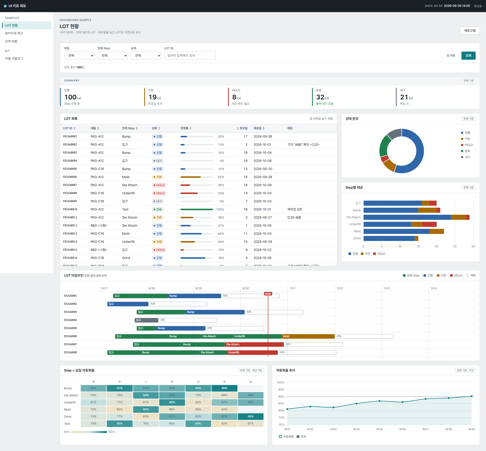
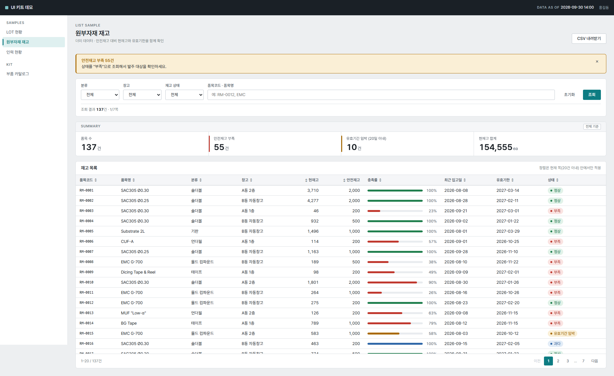
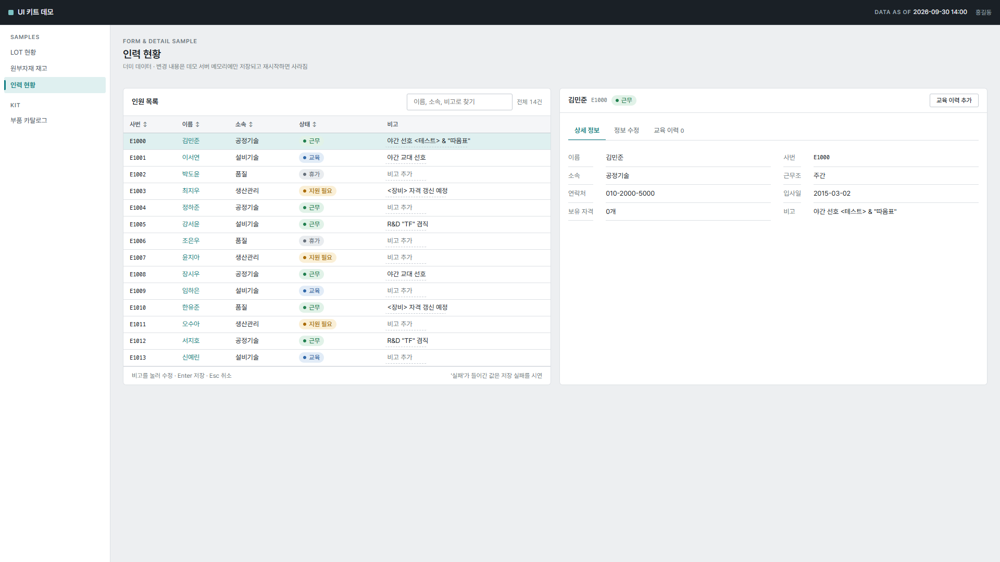

# Flask 공통 UI 키트

사내 여러 Flask 앱이 같은 디자인 언어를 쓰도록 만든 공통 UI 키트입니다.
사내 LLM(OpenCode)은 화면을 **디자인하지 않고**, 검증된 부품을 **조립만** 합니다.

- 키트가 정하는 것: 색·글꼴·간격 토큰, 레이아웃, 메뉴, 부품, 차트 테마, 공통 JS
- 각 앱이 정하는 것: 메뉴 이름, 컬럼, 검색 조건, 상태 문구, 지표 계산, 조회·저장 로직
- 외부 CDN 없이 동작합니다 (모든 파일을 로컬 경로에서 로드). 기준 환경은 Edge 최신 버전, 1920×1080이고 최소 1280px 폭까지 지원합니다.

| 대시보드형 | 목록형 | 입력/상세형 |
|---|---|---|
|  |  |  |

부품 전체는 [previews/catalog_1920.png](previews/catalog_1920.png)에서 볼 수 있습니다. 검증 결과는 [VERIFY.md](VERIFY.md)에 있습니다.

## 폴더 구조

```
AGENTS.md                       사내 LLM 규칙 (프로젝트 루트에 둔다)
app_demo.py                     데모 앱 (더미 데이터, 로컬 확인용)
templates/kit/base.html         기본 레이아웃: 상단바, 사이드 메뉴, 본문 바로가기, 토스트 영역
templates/kit/macros.html       배지·진행률·집계 기준·빈 결과·페이지 번호·차트·데이터 전달 매크로
templates/kit/samples/          lot_dashboard, inventory_list, staff_detail, catalog
static/kit/css/kit.css          토큰 + 모든 부품 스타일 (색은 여기에만 있음)
static/kit/js/kit.js            공통: 정렬, 탭, 모달, 토스트, 알림 닫기, 좁은 화면 메뉴
static/kit/js/kit-chart.js      Chart.js 공통 테마 + 자동 초기화 + 실패/빈 데이터 안내
static/kit/js/kit-optional/     gantt.js, heatmap.js, inline-edit.js, quick-search.js
static/kit/vendor/              chart.umd.min.js (Chart.js 4.5.1) + LICENSE      ← GitHub 형태에만 포함
static/kit/fonts/               PretendardVariable.woff2, D2Coding.woff2 + LICENSE ← GitHub 형태에만 포함
tools/verify_kit.py             헤드리스 Edge 검증 → VERIFY.md, previews/
tools/build_installer.py        kit_installer.txt 생성
kit_installer.txt               메일 전달용 설치 스크립트 (코드 파일만)
```

키트 파일은 모두 `kit/` 아래에 있어서 기존 앱 파일과 겹치지 않습니다. 키트 CSS는 `kit/base.html`을 상속한 페이지에서만 로드되므로, 기존 화면에는 영향이 없습니다.

---

## 5분 적용

### 1) 설치

**GitHub에서 받은 경우**: `AGENTS.md`, `templates/kit/`, `static/kit/`를 Flask 프로젝트의 같은 위치에 복사합니다.

**메일로 `kit_installer.txt`를 받은 경우**:

```bash
ren kit_installer.txt kit_installer.py
python kit_installer.py
```

- 이미 있는 파일은 건너뜁니다. 덮어쓰려면 `--force`, 미리 확인만 하려면 `--dry-run`을 붙입니다.
- 설치 스크립트에는 폰트와 Chart.js가 들어 있지 않습니다. 실행이 끝나면 어디서 받는지 안내가 출력됩니다. 없어도 키트는 동작합니다(차트 자리에 안내 문구가 나오고, 글꼴은 맑은 고딕을 씁니다).
- 파일 내용은 메일 전달 중 깨지지 않도록 base64로 저장했고, 설치할 때 해시를 검사합니다.

### 2) 기존 Flask 앱에 연결

메뉴와 앱 이름은 `context_processor` 한 곳에서 넘깁니다.

```python
@app.context_processor
def inject_kit():
    return {
        "kit_app_name": "재고 관리",
        "kit_nav": [
            {"title": "Monitoring", "links": [
                {"id": "stock", "label": "재고 현황", "href": url_for("stock")},
                {"id": "inbound", "label": "입고 내역", "href": url_for("inbound"), "count": 3},
            ]},
        ],
        # 선택: "kit_home", "kit_updated_at", "kit_user"
    }
```

- 현재 메뉴는 각 화면의 `render_template(..., kit_active="stock")`로 넘깁니다. 해당 링크에 `aria-current="page"`가 출력됩니다.
- 블루프린트가 자체 `static_folder`를 쓰는 앱이면, `static/kit/`는 **앱 기본 static 폴더**에 둡니다. 키트는 `url_for('static', ...)`를 씁니다.
- CSRF를 쓰는 앱(Flask-WTF 등)은 `<meta name="csrf-token" content="{{ csrf_token() }}">`을 추가합니다. 인라인 편집의 저장 요청에 `X-CSRFToken` 헤더가 자동으로 붙습니다.

### 3) 첫 페이지 만들기

```python
@app.route("/stock")
def stock():
    f = {k: request.args.get(k, "") for k in ("category", "q")}
    rows = query_stock(**f)                     # 조회 로직은 앱이 작성
    return render_template("stock.html", kit_active="stock", kit_title="재고 현황",
                           f=f, rows=rows, categories=CATEGORIES,
                           status_map={"정상": "success", "부족": "danger"})
```

```jinja



<div class="stack">
  <div class="page-head"><div><h1 class="page-title">재고 현황</h1></div></div>

  <form class="filterbar" method="get">
    <div class="field"><label for="f-cat">분류</label>
      <select class="select" id="f-cat" name="category">{{ kit.options(categories, f.category) }}</select></div>
    <div class="field"><label for="f-q">품목</label>
      <input class="input" id="f-q" name="q" value="{{ f.q }}"></div>
    <div class="filterbar-actions">
      <a class="btn btn-quiet" href="{{ url_for('stock') }}">초기화</a>
      <button class="btn btn-primary" type="submit">조회</button>
    </div>
    <p class="filterbar-result" role="status">조회 결과 <strong>{{ rows|length }}</strong>건</p>
  </form>

  <section class="panel">
    <div class="panel-head"><h2 class="panel-title">재고 목록</h2></div>
    <div class="panel-body flush"><div class="table-wrap">
      <table class="table" data-kit-sort>
        <thead><tr><th data-sort="id">품목코드</th><th class="num" data-sort="number">현재고</th><th>상태</th></tr></thead>
        <tbody>
        
          <tr><td class="mono">{{ r.code }}</td><td class="num">{{ r.qty }}</td>
              <td>{{ kit.badge(status_map[r.status], r.status) }}</td></tr>
        
          <tr><td class="empty-cell" colspan="3">{{ kit.empty("조건에 맞는 품목이 없습니다", "", url_for('stock')) }}</td></tr>
        
        </tbody>
      </table>
    </div></div>
  </section>
</div>

```

차트나 선택 부품을 쓰는 화면에서만 `{{ kit.scripts("chart") }}`를 추가합니다.

### 4) OpenCode에 AGENTS.md 적용

- `AGENTS.md`를 **프로젝트 루트**(OpenCode를 실행하는 폴더)에 둡니다. OpenCode가 시작할 때 자동으로 읽습니다.
- 이미 `AGENTS.md`가 있으면 키트 규칙을 기존 파일 **맨 위**에 합칩니다. 설치 스크립트는 기존 파일을 덮어쓰지 않습니다.
- 요청 예시: "재고 화면을 kit 샘플 inventory_list 처럼 만들어줘. 컬럼은 …, 조회 조건은 …"
- 사내 LLM은 규칙보다 예시를 따라 합니다. 그래서 `templates/kit/samples/`도 AGENTS.md 규칙을 100% 지키게 만들었습니다(`tools/verify_kit.py`가 검사).

---

## OpenCode 요청문

### 기존 앱 화면을 키트로 바꿀 때

기존 화면은 컬럼, 조회 조건, 데이터가 이미 코드에 있어서 따로 지정하지 않아도 됩니다. 다만 "web ui 변경해줘" 한 줄로 전체를 맡기면 다음 문제가 생길 수 있으니, **화면 하나씩** 아래 조건을 붙여 요청합니다.

- 모양을 바꾸다가 기존 JS, 폼 `name`, 조회 조건, 버튼 동작이 빠질 수 있습니다.
- AGENTS.md가 금지하는 `<script>`·`|safe`가 기존 화면에 있으면 LLM이 규칙을 지키려고 삭제할 수 있습니다.
- 업무 상태 문구를 상태 5종 중 무엇에 연결할지 LLM이 추측합니다.

**진행 순서**

1. 적용 전에 기존 앱을 git에 커밋해 둡니다. 바뀐 내용을 비교하거나 되돌릴 수 있습니다.
2. 아래 **공통 설정 요청**을 1회 합니다.
3. 가장 단순한 화면(목록 화면 등) 하나를 **화면별 요청**으로 바꾸고, 조회·저장이 전과 같은지 확인합니다.
4. 괜찮으면 나머지 화면도 하나씩 진행합니다.
5. OpenCode가 보고한 `[키트 부족]`과 규칙 충돌 내용을 모아 키트 보강 목록으로 씁니다.

**공통 설정 요청 (1회)**

```
AGENTS.md 규칙과 templates/kit/samples/ 를 참고해서 이 앱에 kit를 연결해줘.
- app.py 에 context_processor 로 kit_app_name, kit_nav 를 추가 (메뉴는 지금 있는 화면 목록 그대로)
- 아직 화면 템플릿은 바꾸지 마
- 바꾼 파일 목록을 보고해줘
```

**화면별 요청**

`stock.html`, `inventory_list.html` 부분만 바꿔서 씁니다. 참고할 샘플은 목록형 `inventory_list.html`, 대시보드형 `lot_dashboard.html`, 입력/상세형 `staff_detail.html` 중에서 고릅니다.

```
templates/stock.html 을 kit 로 바꿔줘. inventory_list.html 샘플 구조를 따라.
조건:
- 라우트, 컬럼, 조회 조건, 폼 name, 버튼 동작, API 호출은 그대로 유지
- 파이썬 조회·저장 로직은 수정하지 마
- 기존 <script> 나 |safe 가 있으면 지우지 말고 그대로 두고, 규칙과 충돌한다고 보고해
- 상태 문구를 success/warning/danger/info/neutral 중 무엇으로 연결했는지 표로 보고해
- 키트에 없는 부품이 필요하면 [키트 부족] 형식으로 보고해
```

### 새 화면을 만들 때

새 화면은 코드에 근거가 없으니 업무 내용을 지정합니다.

```
재고 현황 화면을 새로 만들어줘. inventory_list.html 샘플 구조를 따라.
- 메뉴: "재고 현황" (kit_nav 에 추가, kit_active="stock")
- 컬럼: 품목코드(코드값), 품목명, 창고, 현재고(숫자), 안전재고(숫자), 상태
- 조회 조건: 창고(선택), 품목코드·품목명(검색어)
- 상태 연결: 정상=success, 부족=danger, 과다=info
- 데이터 조회 함수는 query_stock(창고, 검색어) 로 만들고, 우선 더미 데이터를 돌려줘
- 키트에 없는 부품이 필요하면 [키트 부족] 형식으로 보고해
```

---

## 실제 동작 기능 / 데모·미연동 기능

| 구분 | 기능 | 상태 |
|---|---|---|
| 실제 동작 (키트) | 레이아웃, 메뉴 선택 표시, 좁은 화면 메뉴 접기, 본문 바로가기 | 동작 |
| | 테이블 정렬(number·text·date·id 자연 정렬, 키보드, `aria-sort`) | 동작 |
| | 탭, 모달(Esc·포커스 가두기·포커스 복귀), 토스트(`aria-live`), 알림 닫기 | 동작 |
| | Chart.js 공통 테마, 데이터 없음 / 로딩 / 로딩 실패 / Chart.js 없음 안내 | 동작 |
| | 간트, 히트맵, 브라우저 빠른 검색 | 동작 |
| | 인라인 편집: 저장 중 → `{ok: true}`일 때만 완료, 실패 시 원래 값 복원, 한글 조합 중 Enter 무시 | 동작 (저장 URL은 앱이 제공) |
| | 매크로: 상태 5종 검증, 진행률 0~100 제한, 선택값 유지 옵션, 조건 유지 페이지 번호 | 동작 |
| 데모 앱에서만 | GET 필터·조회·초기화·빈 결과, 페이지 번호, CSV 내려받기, 입력 폼 서버 검증 | 더미 데이터로 동작 |
| | 저장 API `/api/staff/save` (값에 '실패'가 있으면 실패 응답) | 메모리에만 저장, 재시작하면 사라짐 |
| 미연동 | 실제 DB 조회·저장, 로그인·권한, 엑셀(.xlsx) 내보내기 | 각 앱에서 구현 |
| | 저장 URL을 주지 않은 인라인 편집 | 화면에 "데모: 저장되지 않음" 표시 |

## 개발·검증

```bash
pip install flask
python app_demo.py
```

`http://127.0.0.1:8050`에서 확인합니다. `debug=True`는 **로컬 확인용**입니다. 사내 서버 배포에는 쓰지 않습니다.

```bash
pip install playwright
python tools/verify_kit.py
```

PC에 설치된 Edge를 헤드리스로 띄워 검증합니다. 결과는 `VERIFY.md`와 `previews/*.png`에 기록됩니다.

```bash
python tools/build_installer.py
```

키트 파일을 고친 뒤에는 이 명령으로 `kit_installer.txt`를 다시 만듭니다.

## 부품 목록

뼈대(상단바, 사이드 메뉴, 페이지 헤더, 그리드 2단·3단·메인+사이드, 세로 쌓기), KPI 띠, 테이블, 상태 배지, 진행률 바, 상세 정보 목록, 범례, 집계 기준 표시, 필터바, 입력 폼, 버튼(주요·일반·조용한·위험), 알림 배너, 토스트, 빈 결과, 로딩, 오류 상태, 탭, 모달, 페이지 번호, 차트 영역, 그리고 선택 부품(간트, 히트맵, 인라인 편집, 빠른 검색). 사용법은 `templates/kit/samples/catalog.html`에 있습니다.

## 라이선스

- Chart.js 4.5.1: MIT — `static/kit/vendor/LICENSE.chartjs.md`
- Pretendard 1.3.9: SIL OFL 1.1 — `static/kit/fonts/LICENSE.Pretendard.txt`
- D2Coding 1.3.2 (subset woff2, npm `d2coding`): SIL OFL 1.1 — `static/kit/fonts/LICENSE.D2Coding.txt`
